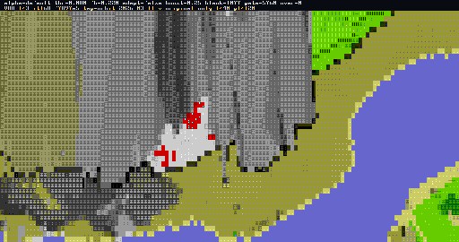

# Asciicker Rust Port

Rust/Bevy reimplementation of the original Asciicker engine, with active work focused on renderer parity, deterministic replay captures, and visual regression testing.



## Current Snapshot

- The canonical docs hub is [docs/INDEX.md](docs/INDEX.md).
- The current renderer work includes 3 comparison modes: `original_only`, `combined`, and `harri_priority`.
- Deterministic stitched variant replays are used as the default visual regression workflow.

## Running

```bash
cargo run --manifest-path engine-port/Cargo.toml --release
```

## Testing

```bash
cargo test --manifest-path engine-port/Cargo.toml
```
